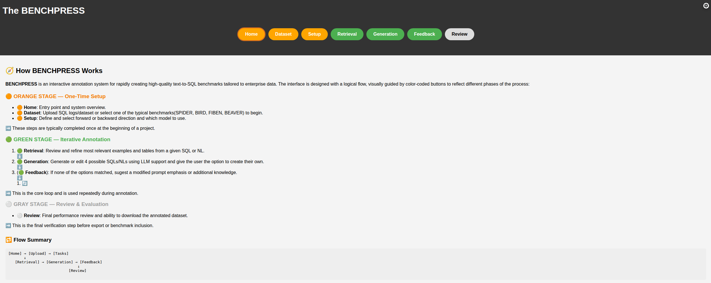

# 🚀 BenchPress

A prototype system for transforming real-world enterprise SQL logs into high-quality Text-to-SQL benchmarks using human-in-the-loop annotation workflows.

<p align="center">
  
</p>

---

## 🔍 Overview

**Enterprise Text-to-SQL** addresses the challenge of building realistic, domain-specific Text-to-SQL datasets by combining:
- SQL log mining
- Human-in-the-loop annotation
- LLM-assisted generation and validation

This system was developed as part of the BENCHPRESS project and supports benchmark creation from internal SQL query logs.

---

## 📺 Demo & Deployment

- **Live Demo:** _Coming soon_ <!-- [Coming soon] or [deployment link if hosted] -->
- **Video Walkthrough:** [▶ Watch on YouTube](https://www.youtube.com/your-demo-video-url)
- **Poster Presentation:** _NEDB 2025 Poster (Link coming soon)_

---

## 📦 Features

- ✅ Upload and parse enterprise SQL logs  
- ✅ Auto-cluster similar queries using LLM embeddings  
- ✅ Generate natural language annotations with prompt-based LLMs  
- ✅ Verify and edit annotations via an easy-to-use UI  
- ✅ Export clean Text-to-SQL benchmark datasets  

---

## 🔧 Installation

```bash
git clone https://github.com/fabian-wenz/enterprise-txt2sql.git
cd enterprise-txt2sql
pip install -r requirements.txt
```

Requirements:
- Python 3.9+
- OpenAI API Key (or compatible LLM provider)
- Optional: [pgvector](https://github.com/pgvector/pgvector) for clustering via vector search

---

## 🚀 Quickstart

```bash
python website/app.py
```


Then open your browser and go to:  
[http://localhost:8000](http://localhost:8000)

---

## 🧠 Annotation Workflow

1. **Input SQL logs** – Upload or load logs from disk  
2. **Preprocessing** – Deduplicate and cluster queries  
3. **Generation** – Generate natural language questions via LLMs  
4. **Verification** – Manually or semi-automatically check the NL-SQL pairs  
5. **Export** – Export benchmark-ready datasets for evaluation or training

<p align="center">
  
</p>

---

## 📁 Project Structure

```text
.
├── data/                # Sample SQL logs and generated benchmark data
├── scripts/             # Preprocessing, clustering, and evaluation scripts
├── app.py               # Main entry point for the UI
├── config.py         # Prompts and LLM interaction
├── demo/                # Screenshots and videos for README
├── requirements.txt     # Python dependencies
└── README.md            # This file
```

---

## 📊 Example Output

```json
{
  "question": "Show the top 10 customers by revenue.",
  "query": "SELECT customer_name FROM sales ORDER BY revenue DESC LIMIT 10"
}
```

---

## 📜 Paper

> **BENCHPRESS: An Annotation System for Rapid Text-to-SQL Benchmark Curation**  
> Fabian Wenz*, Peter Baile Chen*, Moe Kayali, Michael Stonebraker, Cagatay Demiralp  
> _To appear at CIDR 2026_  
> [📄 View on arXiv](https://arxiv.org/abs/2409.02038)

---

## 🙌 Acknowledgements

This project was developed during Fabian Wenz’s time at MIT CSAIL with the support of:

- Prof. Michael Stonebraker  
- Dr. Cagatay Demiralp  
- Peter Baile Chen  
- Dr. Nesime Tatbul

---

## 🛠️ Contributing

We welcome contributions from the community!

If you encounter bugs, want to request features, or contribute code, please:
- Submit an issue
- Fork the repo and open a pull request

---

## 📄 License

This project is licensed under the MIT License. See `LICENSE` for more details.